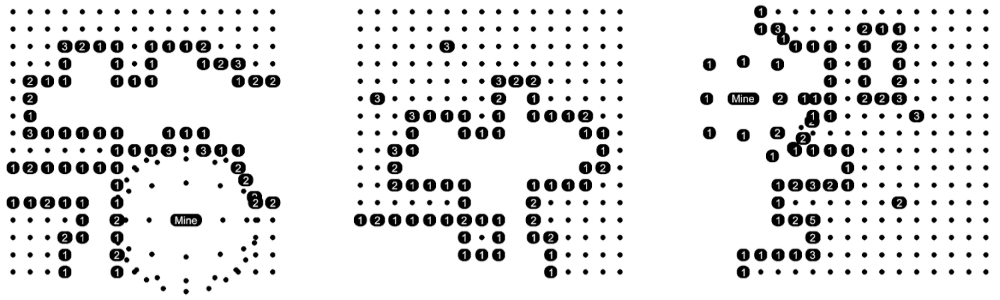
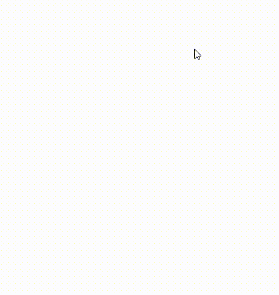

# rhino-minesweeper



Minesweeper game for [Rhino 3D](https://www.rhino3d.com).


## Installation

1. Drop script files to the directory:

    for macOS:
    ```
    /Users/HOME/Library/Application Support/McNeel/Rhinoceros/6.0/Scripts
    ```
    for Windows:

    ```
    C:\Users\UserName\AppData\Roaming\McNeel\Rhinoceros\6.0\scripts
    ```

2. Run script via command:
    ```
    ! _-RunPythonScript ScriptName

    ```

## Screenshots

<p align="center">
  
</p>


## License

Distributed under the MIT License.
